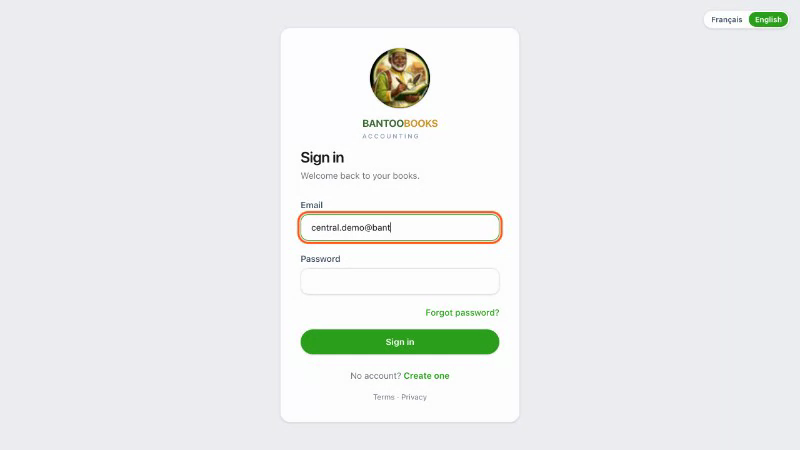
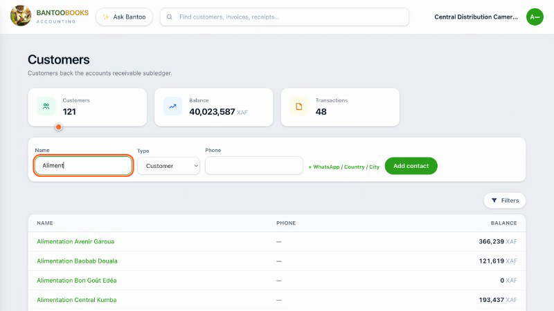
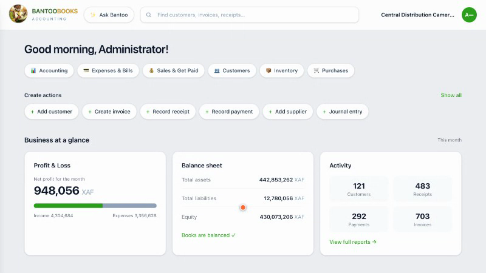
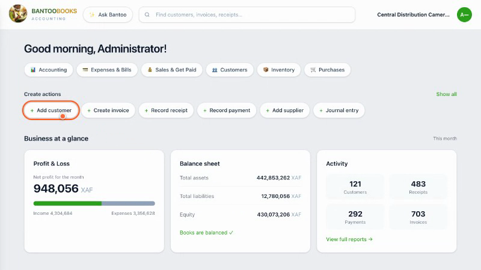
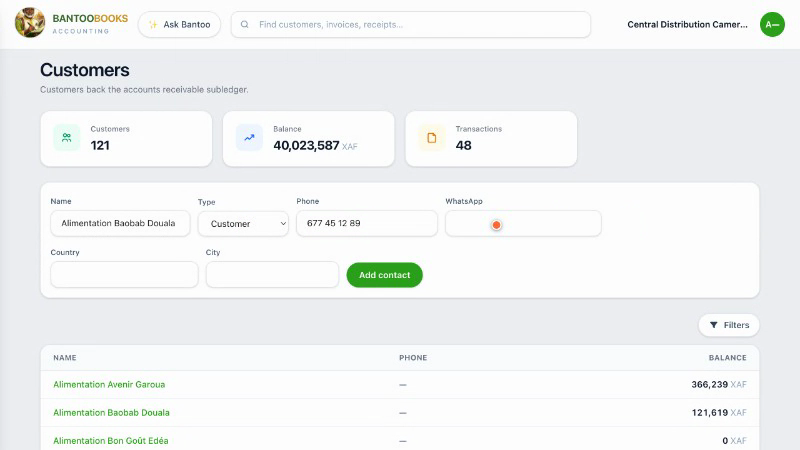
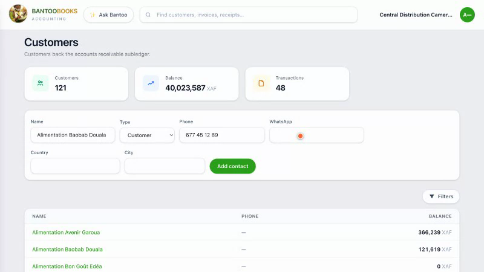
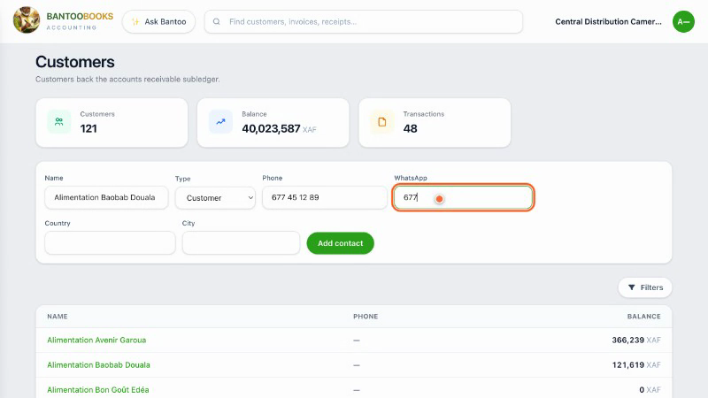

# Video Review — `create-a-customer` (real screen-capture QA pass)

**Date:** 2026-07-06
**Reviewed by:** direct frame-by-frame inspection of a real recording, not inference from code.

## ⚠️ Scope note — read this first

Guidde is a human-triggered browser extension with no headless/API automation surface (confirmed with real sources during this project). No agent can click "Record" inside Guidde or trigger its export. **This review does not involve Guidde at all.** It reviews the actual screen content of a fresh, real `record:video` run — the exact same Playwright-driven browser session that Guidde would sit on top of and capture unmodified. Guidde would not change the cursor motion, typing speed, pacing, or anything else evaluated below; it would just be another recorder pointed at this same screen. Reviewing this footage directly is therefore a faithful, honest proxy for "what a Guidde-recorded video of this tutorial would look like," and is the right way to QA the pipeline before scaling to 20 tutorials.

## Method

1. Produced a fresh recording with `BANTOO_BASE_URL=https://books.bantoobooks.com npm run record:video -- create-a-customer` against the real demo org — a clean, non-hypothetical run, not a reused artifact.
2. Result: `recordings/create-a-customer/raw-recording.webm` (1.5 MB, 800×450, 25 fps, **73.8 s** duration) + `trace.zip` (20.3 MB).
3. `ffmpeg`/`ffprobe` are not installed system-wide in this environment, but Playwright's own build ships a working `ffmpeg` binary in its browser cache (used internally for video muxing). That binary was used directly (`ffmpeg -i raw-recording.webm -r 2 frame-%03d.png`) to decode the real `.webm` into 149 PNG frames at 2 fps (one every 0.5 s) — real decoded video frames, not synthetic screenshots.
4. Frames were reviewed in three passes: a coarse full-length scan (every 5 s) to find the shape of the run, a fine-grained scan (every 0.5–1 s) around every transition/click/type event, and a final pass zeroing in on two anomalies discovered along the way. 13 representative frames were kept as evidence, saved to `tutorial-factory/video-review-screenshots/` and referenced below with their real timestamp in the recording.
5. No temporary code instrumentation was needed for this pass (the ffmpeg route made it unnecessary) — `git diff` on `automation/` is empty, confirming zero code changes were made to produce this review.

## Overall score: **5.5 / 10**

The underlying motion/typing/highlight system (`slowClick`, `slowType`, `highlight`, `moveMouseSmoothly`) is genuinely well-built and looks smooth and human-paced **whenever the app responds promptly** — see the login sequence and the name/type/phone steps, which look close to publish-ready as-is. But this real take spent **roughly 33 of its 73.8 seconds (~45%) frozen on a static screen** waiting on two distinct stalls that have nothing to do with the deliberate `pause()` calls in the scripts. That's the difference between a 5.5 and what would otherwise be an 8+: the motion design is good, but the pipeline has no defense against real production latency turning "a deliberate 1-second beat" into "an unexplained 16-second freeze," which would read as broken/buffering to anyone watching, and would desync any voiceover recorded against `synthesia.md`'s timing.

## Findings by criterion

### Cursor movement — good
The fake cursor (`moveMouseSmoothly`'s eased 28-step animation) glides convincingly from the password field toward "Sign in" (frame 3 below) rather than teleporting. No jump-cuts were observed in any transition that *did* animate.

One real defect: after the "+ WhatsApp / Country / City" reveal-click, the cursor dot is left sitting statically inside the newly-revealed WhatsApp input (its old click coordinates happen to land there once the form reflows) for the entire following freeze — see the "Pauses/unnecessary waiting" section. It's not a motion-quality bug per se, but it means during the worst stall, a static orange dot inside an empty field is exactly the wrong thing to be showing on screen for 16 seconds.

### Typing speed — good
`typeDelayMs: 55` reads naturally on screen — e.g. `central.demo@bant` mid-word and `Aliment` mid-word are both clearly legible partial states, not a single instant fill:

No changes recommended here — this is the best-tuned constant in the system.

### Pauses / unnecessary waiting — **the biggest problem, needs a fix before scaling**
Two long freezes account for the video's poor pacing, and neither is caused by an explicit `pause()` call in the spec:

- **Stall 1 — dashboard, ~17 s of dead air.** The dashboard finishes loading at ~t=15s (frame 4) and then sits **completely unchanged** until the "Add customer" click finally starts at ~t=32s (frame 6) — 10 seconds of that is visible below as frame 5, still pixel-identical to frame 4:

  The code only accounts for ~3s here (`login()`'s trailing `pause()` = 2.5s + `scrollSettleMs` = 0.5s). The other ~14s is unexplained dead time — most likely `waitForAnimation()`'s `page.waitForLoadState("networkidle", { timeout: 8000 })` genuinely burning close to its full 8-second timeout (twice, back-to-back) against the live production app, which may never go fully network-idle (analytics beacons, polling, etc.).

- **Stall 2 — WhatsApp field, ~16 s frozen mid-form.** This is the worst moment in the recording. The WhatsApp/Country/City fields are revealed at ~t=45s, the WhatsApp field is highlighted (orange outline) as if about to be typed into — and then **nothing happens for 16 full seconds**. Three frames taken 5+ seconds apart during this window are visually identical:

  Code only accounts for ~1s (the deliberate `pause(page, 1)` after the reveal click) before typing should start. The other ~15s is unaccounted for — this looks like `highlight()`'s `locator.elementHandle()` or `locator.click()` silently retrying against an actionability check that isn't passing yet (e.g. the just-revealed field not being considered stable/interactable immediately), rather than a `pause()` value that's simply "too long." This needs to be reproduced and root-caused before recording the other 19 tutorials — if it's systemic (triggered by the "reveal new fields, then immediately act on one of them" pattern used elsewhere too), it will recur.

  Nothing else in the review is dramatic enough to keep this out of the top slot: **33 of 73.8 seconds — almost half the video — is unexplained frozen dead air**, concentrated in two spots.

Elsewhere, the deliberate `pause(1)`/`pause(2.5)` calls between steps 2→3, 3→4, 5→6, and 8→9 read as reasonable, watchable beats — no complaints about those.

### Transitions — mostly fine, one segment untestable
The login→dashboard and duplicate-panel→profile-page transitions are clean (no flash of unstyled content, no layout jump). The dashboard→customers-page transition (step 1) couldn't be cleanly evaluated in isolation because it's swallowed inside Stall 1 above.

### Highlights — good, with one clarity gap
The orange glow + outline (`#ff5a1e`, 3px outline + soft shadow) reads clearly against the app's light background in every frame checked — e.g. the "Add customer" pill and the "Type" dropdown are unambiguous:

Gap: because `highlight()` has no signal for "why is this still highlighted," a 700ms intentional highlight and a 16-second stuck highlight (Stall 2) look identical to a viewer in the first couple of seconds — there's no way to tell, just from the visual, that something has gone wrong until an unreasonable amount of time has passed.

### Narration suitability (`synthesia.md`) — currently does not line up
Checked the real per-step timing against `synthesia.md`'s scene timestamps:

- Scene 2 (0:04–0:12, "choose Add customer, type the shop's name") budgets **8 seconds** for reaching and clicking "Add customer." The real footage took **~17 seconds** just to get from dashboard-loaded to that click (Stall 1).
- Scene 5 (0:32–0:42, "reveal WhatsApp/Country/City") budgets **10 seconds**. The real footage spent **~16 seconds frozen** on this exact segment before any typing even started (Stall 2) — voiceover recorded to this script would finish talking about WhatsApp/Country/City roughly 6+ seconds before the screen shows anything happening.

Everything else (scenes 1, 3, 4, 6, 7, 8) is close enough to plausible once the two stalls above are fixed — this isn't a script-writing problem, it's a direct consequence of the two timing stalls.

### Pacing — uneven, bimodal
Ignoring the two stalls, the rest of the run (login typing, name/type/phone, WhatsApp/Country/City typing once it starts, duplicate-panel resolution, landing on the profile) has a consistent, pleasant rhythm — no other segment felt rushed or draggy. The problem is entirely the two stalls, which make the pacing bimodal (either "nicely paced" or "frozen"), rather than evenly slow-and-steady throughout.

### Zoom quality — a real, structural issue
`automation/playwright.config.ts` sets the browser viewport to **1440×900**, but `automation/playwright.recording.config.ts` only sets `video: "on"` (a bare string) with no explicit `size`. Playwright's default behavior in that case is to record at a scaled-down resolution — confirmed via `ffmpeg -i raw-recording.webm`, which reports the actual output as **800×450**, roughly 55% of the live viewport's linear dimensions. Every frame in this review is at that native 800×450 resolution; body text in the app (roughly 13–14px at 1440-wide) is legible in these frames only because they're being viewed near their native size — scaled up to a typical 1920×1080 YouTube canvas (as `youtube.md` presumably targets), this footage would look visibly soft/blurry, well below what a "publish-ready" tutorial video should look like.

### Anything that looks robotic overall
Aside from the two stalls (which read as "broken," not "robotic" — a subtly worse impression), the only mechanical-feeling detail is the highlight color being identical and instant-onset for both "about to click" (700ms, intentional) and duplicate-detection candidate rows (also flashed briefly in the panel) — a minor stylistic nit, not a functional problem.

## Prioritized improvements for `automation/helpers/` (before scaling to the remaining 19 tutorials)

1. **Investigate and fix the two stalls — highest priority.** Add temporary timing instrumentation (e.g. `console.log` timestamps around each `waitForLoadState`, `elementHandle()`, and `click()` call in `waitForAnimation.ts`, `highlight.ts`, and `slowClick.ts`/`slowType.ts`) and re-run `record:video` a few times to see if the stalls are (a) reproducible/systemic — e.g. every "reveal new fields, then immediately highlight one of them" pattern hits an actionability retry — or (b) one-off production network hiccups. If (a), the likely fix is giving newly-revealed elements a brief explicit `waitForSelector(..., { state: "visible" })` or a short `page.waitForTimeout` before `highlight()` grabs an `elementHandle()`, rather than relying on Playwright's implicit actionability retry (which appears to happen silently and slowly, with no visual feedback that anything is happening). If (b), consider swapping `waitForLoadState("networkidle", { timeout: 8000 })` in `waitForAnimation.ts` for a shorter, more predictable timeout (e.g. 3–4s) plus a fixed buffer, so a slow/never-idle production connection can't silently eat up to 8 full seconds of screen time per call.
2. **Set an explicit, higher recording resolution.** In `automation/playwright.recording.config.ts`, change `video: "on"` to `video: { mode: "on", size: { width: 1440, height: 900 } }` (matching the live viewport 1:1) so the raw capture isn't downscaled before any editing/upload step. This is a one-line config change with no risk to the rest of the pipeline.
3. **Make frozen-looking waits visually distinguishable from intentional pauses.** Since `highlight()`'s glow looks identical whether it lasts 700ms or 16s, consider adding a subtle, continuously-animating affordance (e.g. a slow pulse on the outline, or a small "waiting…" indicator) that only appears if a highlight has been active for longer than, say, 2 seconds — this wouldn't fix the underlying stall, but it would stop a real stall from looking indistinguishable from "broken" versus "the app is just being deliberately slow for the camera" if one ever does slip through into a published video.
4. **Re-check `synthesia.md`'s scene budget against real (not just scripted) timing once stalls #1 is fixed.** After the stalls are addressed, re-run the recording and re-diff the real per-step timestamps against the scene timestamps in `synthesia.md` — the two currently-mismatched scenes (2 and 5) should re-align once the stalls are gone, but this should be verified with a fresh real recording rather than assumed.
5. **Minor: reset or hide the fake cursor across page navigations.** Not a bug in this take (it happened to look fine after the final navigation), but `cursor.ts`'s `lastPosition` `WeakMap` is keyed per `Page`, and the cursor element itself lives in the DOM of whichever page currently exists — worth a quick explicit check that `ensureFakeCursor`/`moveMouseSmoothly` never leaves a stale dot visible immediately after a full-page navigation on other tutorials, since this review only exercised one such transition.

## Evidence

All 13 screenshots referenced above are real decoded frames from the actual `raw-recording.webm` produced by this session's `record:video` run, saved at `tutorial-factory/video-review-screenshots/`, named `NN-tSS.Ss-description.png` (timestamp = real position in the 73.8s recording). The full 149-frame set (one every 0.5s) was reviewed to produce this report but is not committed to the repo (kept only in a temp directory) to avoid bloating the repository with near-duplicate frames.

## Recording metadata (for reproducibility)

- Command: `BANTOO_BASE_URL=https://books.bantoobooks.com npm run record:video -- create-a-customer`
- Config used: `automation/playwright.recording.config.ts` (extends `automation/playwright.config.ts`, viewport 1440×900, headed Chromium, `video: "on"`, `trace: "on"`)
- Output: `recordings/create-a-customer/raw-recording.webm` — 800×450, 25 fps, 73.8s, 1.5 MB; `recordings/create-a-customer/trace.zip` — 20.3 MB
- Frame extraction: Playwright's bundled `ffmpeg` binary (found in the Playwright browser cache, e.g. `.../playwright/ffmpeg-1011/ffmpeg-mac`), `ffmpeg -i raw-recording.webm -r 2 frame-%03d.png` → 149 frames
